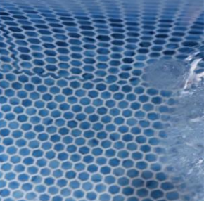
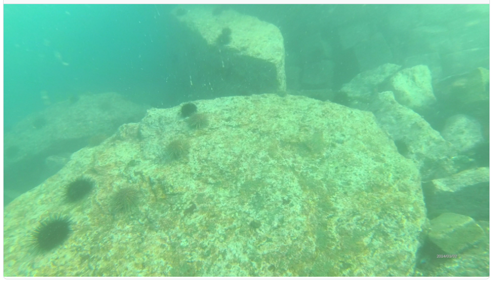
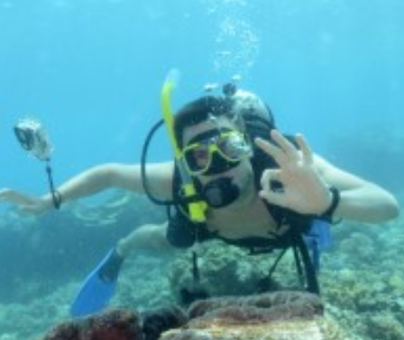
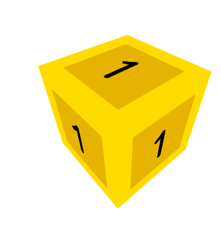

идея такая что Подводное изображение фоновой сцены без целевого объекта (то бишь no_object ) мы ищем в готовых датасетах на платформах по типу Kaggle. 
в документации дали такой пример фото с игрушечного батискафа

Пошуршал немного по сайту, вот что отыскал 
1) Демонстрация

ссылка: https://www.kaggle.com/datasets/banuprasadb/underwater-objects

прикольный датасетик, ставлю лайк

2) еще неплохой вариант
ссылка: https://www.kaggle.com/datasets/tsunamiserra/icm-benchmark-20

для датасета из изображений макета «чёрного ящика» с крупной цифрой написал скрипт для генерации просто желтого кубика с заданной цифрой на белом фоне который можно вращать и получить огромный набор

затем сделал скрипт чтоб  накидывать на фото морского дна в рандомное место фото кубика, применить синие и зеленые фильтры и прочую мишуру