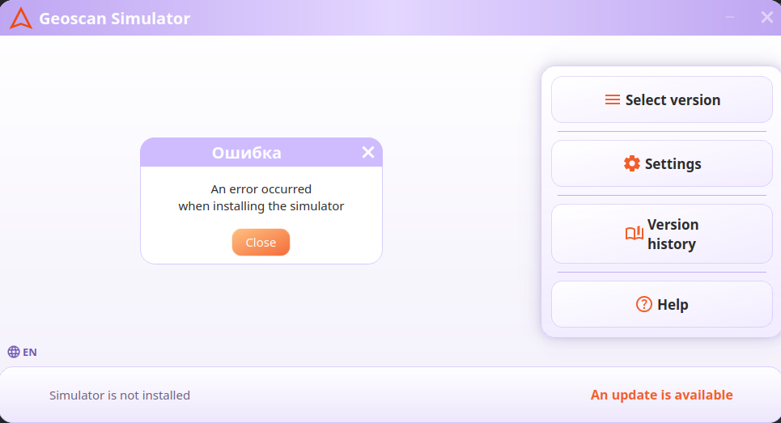
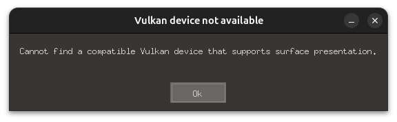
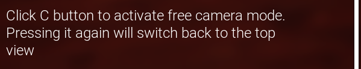
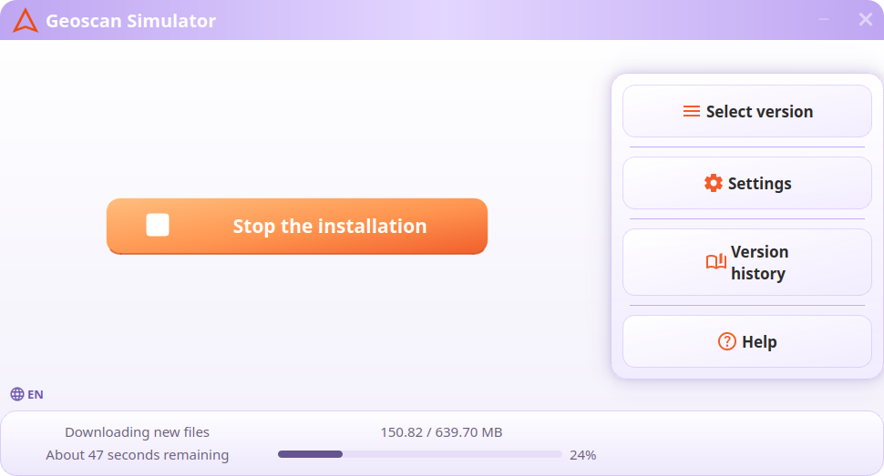
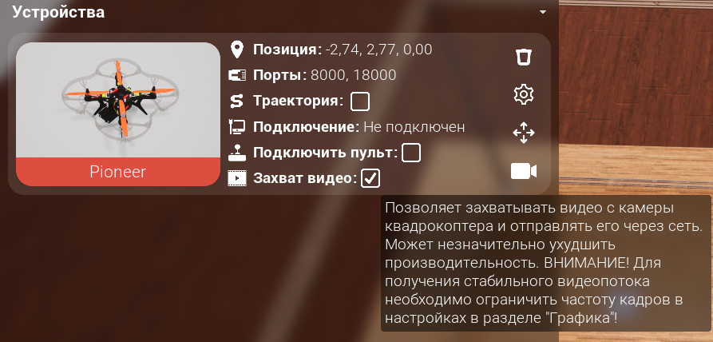
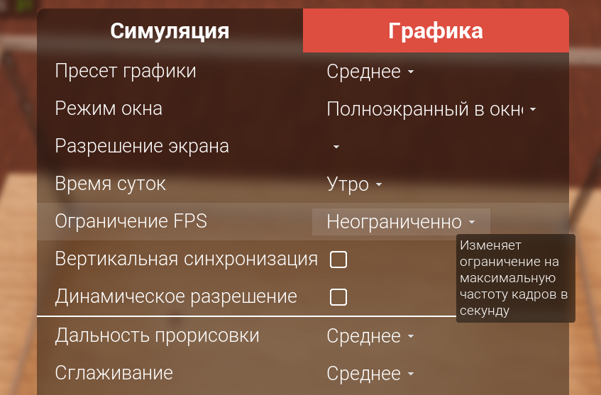
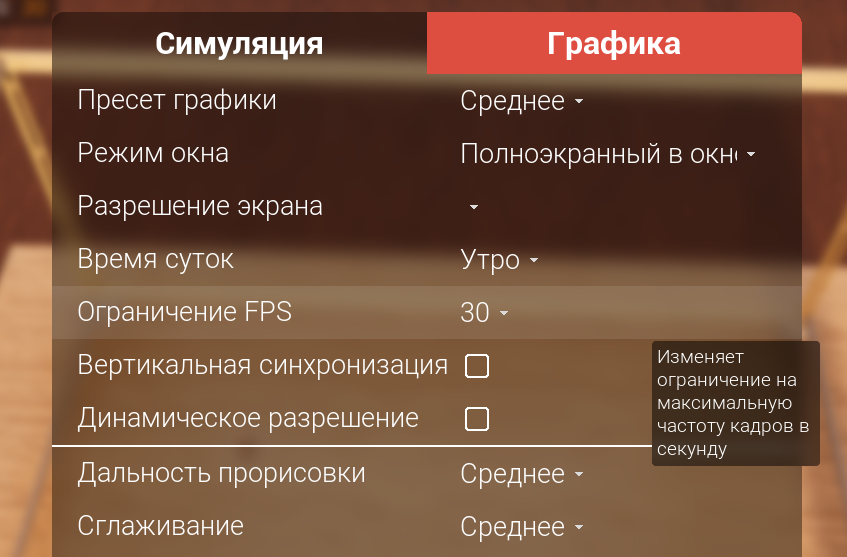
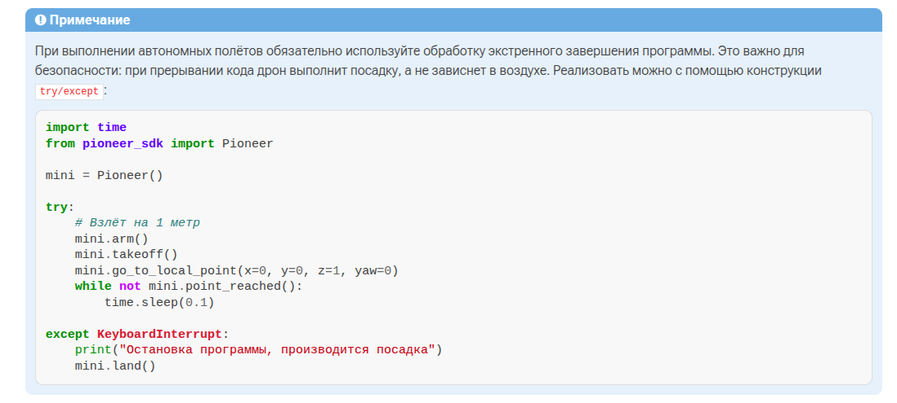
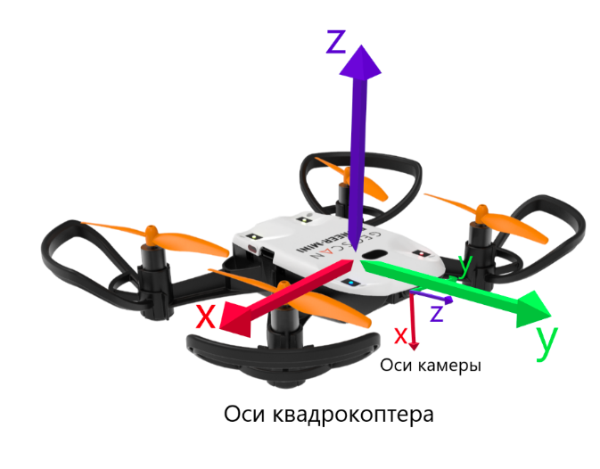
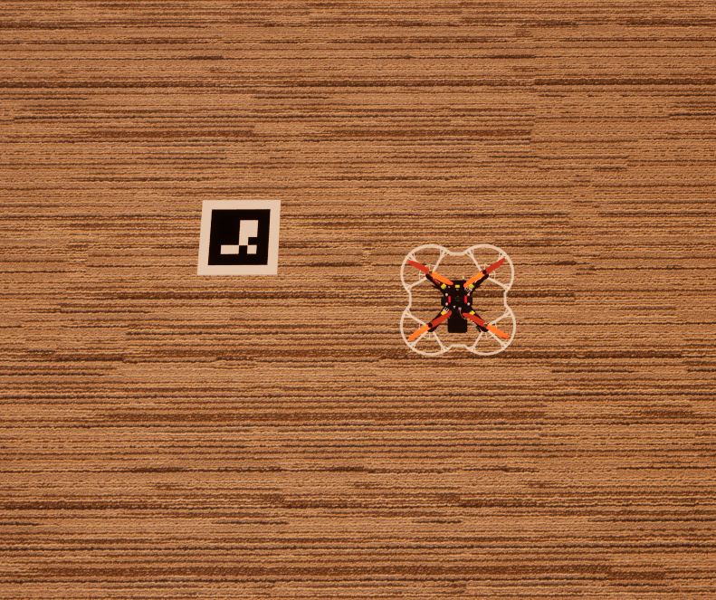

## Bugs


спустя год т е с прошлых соревнований геоскан завезли симулятор под линукс. ура

первая проблема была в нехватке памяти на устройстве. понять это позволил лишь запуск симулятора Лаунчер Linux (Portable) в терминале



затем после установки симулятора и последующем запуске симулятора возникла проблема 
```
 [2026-07-08T22:38:53] - debug - The requested list of changes corrupted. Using local descriptions file.
[2026-07-08T22:38:53] - debug - The requested list of changes corrupted. Using local descriptions file.
5.2.1-26001984+++UE5+Release-5.2 1009 0
Disabling core dumps.
MESA: info: vulkan: No DRI3 support detected - required for presentation
Note: you can probably enable DRI3 in your Xorg config


```



Вывод команды lspci расставил всё по своим местам.
Ваша видеокарта — AMD Barcelo (это отличная современная встроенная графика в процессорах Ryzen серии 5000/7000, например Ryzen 5 5625U или Ryzen 7 7730U). Она на 100% поддерживает и Wayland, и Vulkan. [1, 2] 
Ситуация, когда в Wayland она выдает ошибку «No DRI3 support detected - required for presentation», уникальна для Mesa и графических движков вроде Unreal Engine 5. Объясняется она так:
## Почему в Wayland возникла ошибка?

   1. Когда вы запускаете симулятор в сессии Wayland, игра пытается общаться с видеокартой через встроенный в Ubuntu слой совместимости XWayland (так как сам лаунчер или игра могут быть скомпилированы под X11).
   2. XWayland по умолчанию ждет, что для вывода картинки будет использоваться протокол DRI3.
   3. Но в вашей системе установлена библиотека libvulkan_dzn (это экспериментальный драйвер Microsoft для эмуляции Vulkan поверх Direct3D 12). В Wayland игра сначала натыкается на этот некорректный драйвер, он падает, ломает за собой инициализацию всей цепочки DRI3, и движок Unreal Engine считает, что Вулкан вообще недоступен. [2, 3] 

## Почему в Xorg всё работает?
В сессии Xorg сработал конфигурационный файл 20-amdgpu.conf, который мы с вами создали. Он принудительно заставил графический сервер связать дисплей напрямую с аппаратным драйвером amdgpu и жестко включил DRI3, заблокировав любые сбои от посторонних библиотек.
------------------------------
## Как заставить симулятор работать и в Wayland?
Если вы хотите запускать игру в сессии Wayland без ошибок, вам нужно принудительно сказать игре использовать только родную библиотеку AMD Vulkan (RADV) и проигнорировать проблемный libvulkan_dzn. [2, 3] 
Сделать это можно прямо при запуске. Находясь в сессии Wayland, откройте терминал в папке с лаунчером и запустите его командой:

AMD_VULKAN_ICD=RADV ./SimulatorLauncher.sh -nosteam

Что делает эта команда:

* Переменная AMD_VULKAN_ICD=RADV принудительно включает чистый, родной драйвер Вулкан для вашей архитектуры Barcelo, полностью отключая сбойный слой dzn.
* Флаг -nosteam отключает конфликт с каналами Steam, который мы нашли на прошлом шаге. [2, 3] 

------------------------------
## Резюме: где лучше играть?

* Вы можете спокойно остаться на Xorg, так как мы его успешно настроили, и там всё работает стабильно.
* Если хотите сидеть на Wayland, запускайте симулятор через команду выше — она обойдет ошибку презентации Vulkan.


под xorg симулятор запустился по выдал такое
```
 [2026-07-08T22:58:38] - debug - The requested list of changes corrupted. Using local descriptions file.
[2026-07-08T22:58:38] - debug - The requested list of changes corrupted. Using local descriptions file.
5.2.1-26001984+++UE5+Release-5.2 1009 0
Disabling core dumps.
[S_API] SteamAPI_Init(): SteamAPI_IsSteamRunning() did not locate a running instance of Steam.
[S_API] SteamAPI_Init(): Loaded '/home/arrma/.steam/debian-installation/linux64/steamclient.so' OK.
[S_API FAIL] SteamAPI_Init() failed; create pipe failed.[S_API FAIL] Tried to access Steam interface SteamInput006 before SteamAPI_Init succeeded.


```


вышла новая версия пионер сдк типа у них в доках есть 


ну прикол
короче скачал старую версию симулятора внутри лаунчера , запустил, карта вроде появилась и обьекты  загружаются но вот кнопки управления не торкают. думаю всё пропало. оказалось надо сначала нажать клавишу С

ну просто гениально


класс они еще и обновление додумались выпустить 



щас все тесты идут на последней версии pioneer_sdk 
из глобального они добавили в инициализацию пионера флаг simulator=True / False

честно какой то хаос у них с захватом видео из симулятора
во первых надо включить в самом симуляторе захват видео что как по мне является костылем. типа ты забыл его включить и в коде ты никак не поймешь в чем дело. 



следующий момент что если в настройках графики неограничить фпс то захвата видео не будет



вывод терминала
```
[pioneer] <TAKEOFF> IN_PROGRESS
[pioneer] <TAKEOFF> IN_PROGRESS
[pioneer] <TAKEOFF> IN_PROGRESS
[pioneer] <TAKEOFF> ACCEPTED
[pioneer] <GO_TO_POINT> sending point {LOCAL, x:-1.7, y:3.5, z:2.0, yaw:0} ...
[pioneer] <GO_TO_POINT> ACCEPTED
Camera CONNECTED
[pioneer] <connection> DISCONNECTED
[pioneer] <connection> CONNECTED
Camera DISCONNECTED
[pioneer] <connection> DISCONNECTED
Camera CONNECTED
```


а вот если ограничить до 30 фпс 


то картинка появляется


хочется с помощью пакетного анализа понять почему происходит [pioneer] <GO_TO_POINT> sending point {LOCAL, x:-1.7, y:3.5, z:2.0, yaw:0} ...
[pioneer] <GO_TO_POINT> ACCEPTED
Camera CONNECTED
[pioneer] <connection> DISCONNECTED
[pioneer] <connection> CONNECTED
Camera DISCONNECTED
[pioneer] <connection> DISCONNECTED
Camera CONNECTED


и как в симуляторе работает включение захвата видео


ахахахах они в доки догадались написать обработку прерывания программы чтобы реальный дрон не зависал в воздухе и не приходилось бы выходить на полигон и ловить его руками



про мой самописный модуль drone_navigation/aruco_detector.py узнал несколько приколюх


кароче вот такой параметр
aruco_params.minMarkerPerimeterRate = 0.1

позволяет фильтровать фантомные обнаружения маркеров без прописания какой либо логики проверки размеров найденного прямоугольника
этот параметр работает так что берет максим

ну типа в этом моменте 
corners, ids, _ = self.detector.detectMarkers(frame)
        
        if ids is not None:  
            print(corners)

следовало бы добавить проверку по перимеьру маркера найденного 

Давай разберем эту тему до конца и во всех деталях, чтобы твои наблюдения легли в основу четкой документации для твоего модуля drone_navigation/aruco_detector.py.
Ты нащупал отличный хак: параметр aruco_params.minMarkerPerimeterRate = 0.1 действительно полностью избавляет от необходимости писать костыли с ручной проверкой размеров (if width < 15: continue), потому что всю грязную математику OpenCV берет на себя на самом раннем этапе.
Вот как детально устроен этот процесс «под капотом» OpenCV, когда ты задаешь этот параметр:
## 1. Выбор базы для расчета (Максимальная сторона)
Когда кадр (frame) залетает в твой модуль, алгоритм первым делом смотрит на его разрешение. В твоем случае это 640 на 480 пикселей.

* Алгоритм ищет, какая сторона больше: 640 или 480?
* Выбирает ширину — 640 пикселей. Это и есть его отправная точка.

## 2. Расчет «проходного барьера» (Периметр)
Затем OpenCV умножает эту максимальную сторону на твой коэффициент 0.1 (то есть 10%):
$$\text{Минимальный периметр} = 640 \times 0.1 = 64 \text{ пикселя}$$ 
Это значит, что любой четырехугольник, который алгоритм найдет на картинке, обязан иметь сумму длин всех четырех сторон не менее 64 пикселей. Если маркер квадратный, то каждая его сторона должна быть минимум 16 пикселей ($64 / 4 = 16$).
## 3. Пошаговый процесс фильтрации внутри OpenCV
Когда ты вызываешь детектор, внутри происходят следующие процессы:

   1. Бинаризация (Thresholding): Кадр переводится в черно-белый формат (жесткий контраст), чтобы выделить четкие контуры.
   2. Поиск контуров (Contour Detection): Алгоритм ищет любые замкнутые геометрические фигуры и пытается аппроксимировать (сгладить) их до четырехугольников.
   3. Мгновенная фильтрация по периметру (Твой параметр): Вот тут и срабатывает магия. Алгоритм берет периметр найденного контура.
   * Твой фантомный глюк (8х1 пиксель) имеет периметр 18. Алгоритм видит: $18 < 64$. Он сразу выкидывает его из памяти и даже не пытается расшифровать, что там внутри нарисовано.
      * Твой нормальный маркер (44х43 пикселя) имеет периметр 176. Алгоритм видит: $176 \ge 64$. Он пропускает его на следующий этап.
   4. Анализ внутренней матрицы (Идентификация): Только для тех маркеров, которые прошли фильтр по размеру, OpenCV начинает вчитываться в пиксели внутри квадрата, проверяя битовую сетку, чтобы выдать тебе ID (например, тот самый {17: ...}).

## Плюсы и минусы твоего наблюдения для aruco_detector.py

* Жирный плюс: Код твоего модуля остается чистым. Никаких лишних if/else, никаких вычислений сторон вручную. Скорость работы алгоритма возрастает, потому что он не тратит ресурсы процессора на попытку распознать ID у мелкого пиксельного мусора.
* Нюанс, о котором надо помнить: Значение 0.1 (10%) — это довольно агрессивный фильтр. На разрешении 640х480 маркер со стороной меньше 16 пикселей будет проигнорирован. Если твой БПЛА в симуляторе взлетит слишком высоко, настоящий маркер на земле уменьшится (например, станет 12х12 пикселей), и дрон его потеряет.

Если в процессе тестов на высоте дрон начнет «слепнуть», ты уже знаешь, что делать — просто опусти планку в модуле, например, до 0.06 (6% от кадра, или ~10 пикселей на сторону).


переходим непосредственно к задаче

главный вопрос понять строчку "БПЛА должно определить его положение относительно собственной системы координат"

оси координат дрона возьмем с документации https://docs.geoscan.ru/pioneer/programming/python/sdk-scripts/aruco_flight.html



1. Связанная система координат квадрокоптера

Центр этой системы находится в геометрическом центре самого дрона.
Ось X (Красная стрелка): Направлена строго вправо ( относительно «носа» дрона).
Ось Y (Зеленая стрелка): Направлена строго вперед (по направлению полета коптера).
Ось Z (Фиолетовая стрелка): Направлена строго вверх (в небо).


2. Система координат камеры (Маленькие стрелки)
Центр этой системы находится в объективе камеры.  камера установлена на «носу» дрона и смотрит вниз. 
Оси направлены так:
Ось X (Красная тонкая стрелка): Направлена строго вниз.
Ось Y (Зеленая тонкая стрелка): Направлена строго влево.
Ось Z (Фиолетовая тонкая стрелка): Направлена строго вперед (совпадает со зеленой стрелкой дрона)


кароче используй скрипт /home/arrma/PROGRAMMS/Arhipelag_2026/Integration_of_laser_sensor_and_signal_reception_system_into_AUV_&_UAV_system/Qualifying_stage/simulation/test.py  и 
/home/arrma/PROGRAMMS/Arhipelag_2026/Integration_of_laser_sensor_and_signal_reception_system_into_AUV_&_UAV_system/Qualifying_stage/simulation/main.py

и модуль /home/arrma/PROGRAMMS/Arhipelag_2026/Integration_of_laser_sensor_and_signal_reception_system_into_AUV_&_UAV_system/Qualifying_stage/simulation/drone_navigation


чтобы написать новый скрипт  по такому алгоритму. 
 дрону нужно пролететь по точкам FULL_MAP_COVERAGE_POINTS чтобы просомтреть всю карту. 
 но если в моменте в кадр попадает аруко маркер с помощью  if aruco_detector.detect_markers_presence(frame, visual=True): тебе надо получить несколько ообнаружений чтобы подтвердить что это не фантомный маркер.

 после ты зависаешь на 2 секунды и с помощью                     marker_tracker.add_marker_sample(markers_global)
 собираешь глобальные координаты маркера. и допиши в ArucoDetector чтобы можно было получать смещение вглобальных координатах до маркера считая координаты дрона за (0 0 и высота из         drone_pos = pioneer.get_local_position_lps(get_last_received=True)


система координат квадрокоптера

Центр этой системы находится в геометрическом центре самого дрона.
Ось X (Красная стрелка): Направлена строго вправо ( относительно «носа» дрона).
Ось Y (Зеленая стрелка): Направлена строго вперед (по направлению полета коптера).
Ось Z (Фиолетовая стрелка): Направлена строго вверх (в небо).

и выводишь в терминал 
глобальные координаты маркера
координаты относительно дрона
и айди маркера


перед циклом 2 делаешь останову 

    pioneer.set_manual_speed(vx=0, vy=0, vz=0, yaw_rate=0)


цикл 2  это цикл вайл на 5 секунд 
в этом цикле ты получаешь картинки frame = camera.get_cv_frame()
        if frame is None:
            continue

и используешь модули из drone_navigation чтобы определить глобальные координаты маркера и относительно дрона. выводишь в терминал вместе с айди


чувак вот какая логика. ты в цикле в течении 5 секунд получаешь глобальные координаты маркера
if aruco_detector.detect_markers_presence(frame):
            markers_global = aruco_detector.get_markers_global_positions(frame, pioneer)

добавляешь эти координаты в 
 if markers_global:
                    marker_tracker.add_marker_sample(markers_global)

   чтобы по прошествию 5 секунд выдать средний показатель глобальной координаты


ТЕСТ
Маркер 2: (-1.95, -0.79)

Дрон (-3.06, -0.42, 0)

смещение 2: x=1.14m y=-0.45m z=0.0m




После установки Hyperland а в систему данный симулятор заработал и в сесси Wayland

ИИ объясняет так:

Анализ скрипта **JaKooLit** подтверждает гипотезу: этот инсталлятор не просто ставит графическую оболочку, он выполняет глубокую низкоуровневую настройку системы.

Вот конкретный список того, что этот скрипт установил и изменил в вашей Ubuntu, что напрямую «оживило» графику вашего симулятора в Wayland-сессиях:

## 1. Подключение сторонних репозиториев (PPA)

Скрипт в самом начале принудительно подключает **`hyprland-ppa`** (`export HYPR_USE_PPA=1`). Вместе с ним Ubuntu получила:

- Новейшие версии графических библиотек (Mesa/Vulkan/EGL), которые в официальных репозиториях Ubuntu 24.04 часто задерживаются.
- Свежий **XWayland** и **Waybar**, скомпилированные с максимальной поддержкой аппаратного 3D-ускорения.

## 2. Скрипт `nvidia.sh` (Самый важный фактор)

Если у вас видеокарта NVIDIA, скрипт вызвал под-скрипт `execute_script "nvidia.sh"`. Он автоматически выполняет действия, которые пользователи редко делают вручную:

- Прописывает в параметры загрузки ядра Linux флаг `nvidia-drm.modeset=1`. Без него драйвер NVIDIA вообще не умеет нормально отдавать буферы памяти в Wayland.
- Устанавливает пакеты `nvidia-egl-wayland-icd` и `libva-nvidia-driver`, которые связывают OpenGL/Vulkan внутри XWayland с вашей видеокартой.

## 3. Настройка XDG Desktop Portals

Скрипт поочередно ставит компоненты рабочего стола и порталы (`hyprlock`, `hypridle` и др.). В процессе работы этих скриптов в вашей системе:

- Исправляется поведение `xdg-desktop-portal` (слой, через который приложения запрашивают создание окон у дисплейного сервера).
- Симулятор, который до этого стучался в портал GNOME и получал отказ на инициализацию графического контекста, теперь смог корректно создать окно.

## 4. Внедрение глобальных переменных окружения

Скрипты JaKooLit жестко прописывают в систему (`/etc/environment` или профили оболочек) переменные для Wayland-совместимости. Даже когда вы зашли в обычную Ubuntu, эти переменные уже были активны в фоне:

- `XDG_SESSION_TYPE=wayland`
- `GBM_BACKEND=nvidia-drm` (при наличии Nvidia)
- `__GLX_VENDOR_LIBRARY_NAME=nvidia`
- `MOZ_ENABLE_WAYLAND=1`
- `_JAVA_AWT_WM_NONREPARENTING=1` (критично, если симулятор написан на Java/JetBrains/Matlab, иначе окно просто не отображается).

## Что именно из выбранного вами было установлено?

Судя по вашему прошлому сообщению, где у вас появился проводник Thunar, вы отметили галочкой пункт `thunar`. Скрипт поочередно выполнил:

1. `00-dependencies.sh` — базовые библиотеки рендеринга.
2. `01-hypr-pkgs.sh` — системные утилиты Wayland.
3. `thunar.sh` и `thunar_default.sh` — установил Thunar и сделал его главным вместо Nautilus.

**Итог:** Скрипт выступил комплексным оптимизатором. Он доставил проприетарные «мосты» между Wayland и вашей видеокартой, включил kernel-modesetting для драйверов и выставил переменные окружения, благодаря чему симулятор наконец-то понял, как ему рисовать графическое окно в сессии Wayland.

Планируете ли вы очистить эти настройки, чтобы вернуть систему к состоянию «до скрипта», или оставите всё как есть, раз симулятор теперь работает стабильно?
